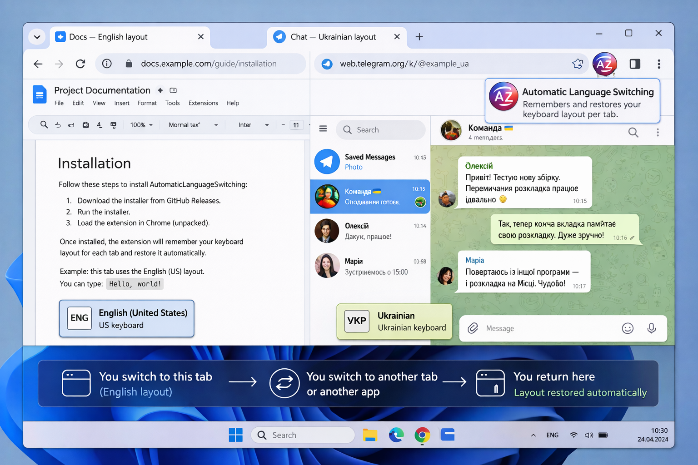

# AutomaticLanguageSwitching

AutomaticLanguageSwitching is a Windows-only tool for multilingual Chrome users who switch keyboard layouts often. It remembers the active Windows keyboard layout for each Chrome tab during the current browser session and restores that layout when you return to the tab.

It works through a Chrome extension plus a Windows Native Messaging host. The installer sets up the native host and prepares the unpacked extension folder locally; the final Chrome `Load unpacked` step is still manual.

## Demo

## The Problem It Solves

If you work across multiple languages, different tabs often imply different expected layouts:

- one tab for English search or documentation
- another tab for Ukrainian or Russian messaging
- another tab for admin tools, forms, or translation work

Chrome does not manage keyboard layout per tab on its own. That leads to constant manual switching and easy mistakes when you return to a tab after working somewhere else.

AutomaticLanguageSwitching reduces that friction by remembering the layout you used for each tab and restoring it when that tab becomes active again.

## Key Features

- Per-tab keyboard layout memory for the current Chrome session
- Automatic restore when switching between Chrome tabs
- Automatic restore when returning from another Windows application to the same Chrome tab
- Windows Native Messaging host installed by the Windows installer
- Best-effort enablement of the Windows setting for separate input methods per app window
- Runtime re-check and best-effort self-healing of that Windows setting
- Lightweight logging for troubleshooting

## How It Works

At a high level:

1. The extension watches the active Chrome tab.
2. When you switch tabs, it notifies the Windows native host.
3. The native host remembers the current Windows keyboard layout for the tab you are leaving.
4. The native host restores the remembered layout for the tab you are entering, if one is known.
5. When focus returns from another Windows application back to the same Chrome tab, the host restores that tab's remembered layout again.

## Installation

1. Download `AutomaticLanguageSwitching-Setup.exe` from GitHub Releases.
2. Run the installer.
3. The installer:
   - installs the Windows native host
   - best-effort enables the Windows setting `Let me use a different input method for each app window`
   - opens local installation instructions
   - opens the installed extension folder in Explorer
4. Open `chrome://extensions` manually in Chrome.
5. Enable `Developer mode`.
6. Click `Load unpacked`.
7. Select:
   `%LOCALAPPDATA%\AutomaticLanguageSwitching\Extension`
8. If the toolbar icon is not visible, open Chrome's Extensions menu and pin `Automatic Language Switching` manually.

## Usage

After installation:

1. Open normal web pages in Chrome.
2. Use the keyboard layout you want in each tab.
3. Switch between tabs normally.
4. Switch to another Windows application and back if needed.

The extension remembers layouts during the current Chrome session and restores them when you return to tabs that already have a remembered layout.

## Important Notes and Limitations

- Windows only
- Chrome only
- The extension is loaded manually as an unpacked extension
- The final `Load unpacked` step in Chrome is required
- Toolbar pinning is manual; Chrome controls that
- Session-only memory is intentional
- Layout memory is not persisted across a full Chrome restart
- No Chrome Web Store distribution is planned right now

## Troubleshooting

If layout restore is inconsistent:

1. Confirm the extension is loaded from:
   `%LOCALAPPDATA%\AutomaticLanguageSwitching\Extension`
2. Confirm the native host was installed successfully.
3. Check that this Windows setting is enabled:
   `Settings > Time & language > Typing > Advanced keyboard settings > Let me use a different input method for each app window`
4. If the toolbar icon is not visible, pin the extension manually from Chrome's Extensions menu.
5. Reload the unpacked extension in `chrome://extensions` after updating or reinstalling.
6. Test on normal web pages rather than restricted Chrome pages such as `chrome://` pages or the Chrome Web Store.

If the Windows per-app input setting was disabled later, the native host will try to enable it again at runtime. If that still fails, the extension logs a warning in the service worker console.

## Current Release and Distribution

The current public release line is `v0.2.0`.

Distribution model:

- GitHub Releases for the Windows installer
- local unpacked Chrome extension loading
- no Chrome Web Store distribution

## Why This Exists

This project exists for people who actively work across multiple languages and want tab-level layout behavior that Chrome and Windows do not provide by default. The goal is practical workflow improvement, not a large extension platform or settings-heavy product.

## Repository Structure

- [`extension/`](./extension) Chrome extension source
- [`native-host/`](./native-host) Windows native host source and manifest template
- [`installer/windows/`](./installer/windows) Windows installer and staging scripts
- [`docs/`](./docs) protocol notes and development documentation
